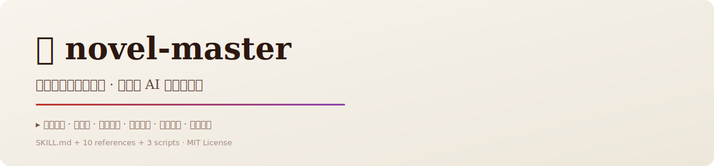

# 📖 novel-master

> **Publication-Grade Chinese Novel · Full-Stack AI Creative Writing Kit**
>
> End-to-end novel writing assistant for OpenClaw AI Agents, covering the complete pipeline from inspiration to final manuscript.

<p align="center">
  <picture>
    <source media="(prefers-color-scheme: dark)" srcset="assets/banner-dark.svg">
    
  </picture>
</p>

<p align="center">
  <a href="README.md">中文</a> · <a href="README_EN.md">English</a>
</p>

<p align="center">
  <a href="https://clawhub.ai/USER/skills/novel-master"></a>
  <a href="https://github.com/USER/novel-master"></a>
  <a href="LICENSE"></a>
</p>

---

## 🌟 Why novel-master?

| Dimension | Traditional AI Prompting | **novel-master** |
|-----------|-------------------------|-----------------|
| 🎯 Writing Standard | Random output, inconsistent quality | **Publication-grade**: refined prose, emotional restraint, thematic depth |
| 📋 Workflow | Improvised, no structure | **Standardized pipeline**: Setup → Outline → Write → Quality Control |
| 🔗 Foreshadowing | Pure memory, easy to miss | **Structured tracking**: tiered system with automatic alerts |
| 🧠 Theory Base | Fragmented knowledge | **Systematic theory**: McKee, Field, Jin Shengtan, Hitchcock |
| 🎭 Characters | Stereotyped | **Voice card system**: contradictions, flaws, action-based characterization |
| 📚 References | Manual searching needed | **10 built-in docs**: scenes, structure, style, dialogue, genres |

---

## ✨ Key Features

- **📋 Standardized Creative Pipeline**
  Project Setup → Creative Brief → Arc Outline → Chapter Outline → Writing → Foreshadowing → Quality Control

- **🔗 Foreshadowing Engine**
  3-tier foreshadowing system (light/medium/heavy) with automatic registration, recovery reminders, and overdue alerts

- **🎭 Character Voice Cards**
  Independent voice profiles for each character — speech patterns, thought processes, inner secrets, character arcs

- **🧠 Built-in Literary Theory**
  McKee's "Story", Syd Field's 3-Act Paradigm, Blake Snyder's "Save the Cat" 15 Beats, Cao Xueqin's "Grass Snake, Grey Line", Hitchcock's suspense formula

- **📖 10 Reference Documents**

  | Document | Purpose |
  |----------|---------|
  | `references/scene-writing.md` | 7 scene types + transitions |
  | `references/dramaturgy.md` | 3-Act / Save the Cat / Hero's Journey |
  | `references/character-design.md` | 7 principles of characterization |
  | `references/style-guide.md` | Publication-grade style guidelines |
  | `references/foreshadowing.md` | 3-tier foreshadowing system |
  | `references/plot-structure.md` | Structure deep-dive + variants |
  | `references/classic-writing-books.md` | Essential literary theory |
  | `references/genres.md` | Genre-specific guides |
  | `references/banned-words.md` | Quality self-check checklist |
  | `references/term-mappings.md` | Terminology mapping (reserved) |

- **🔧 Helper Scripts**
  `scripts/init_book.py` — one-click project scaffolding
  `scripts/track_foreshadowing.py` — foreshadowing CRUD management
  `scripts/update_state.py` — writing progress tracking

---

## 🚀 Quick Start

### Install

```bash
# Via OpenClaw
openclaw skills install novel-master

# Via ClawHub CLI
clawhub install novel-master
```

### Start Writing

Just tell your AI: **"I want to write a mystery novel"**

The AI will automatically:
1. Load genre references → 2. Generate a Creative Brief → 3. Produce Arc Outlines → 4. Write chapters → 5. Track foreshadowing → 6. Self-check quality

### Project Directory

```
~/.qclaw/workspace/novels/<book-name>/
├── settings/
│   ├── world.md          # World overview
│   ├── characters/       # Character voice cards
│   ├── geography.md      # Geography & factions
│   └── rules.md          # World rules
├── outline/
│   ├── arc-outline.md    # Arc outlines
│   └── chapter-outline.md # Chapter outlines
├── chapters/             # Chapter content
├── tracker/
│   ├── foreshadowing.json # Foreshadowing tracker
│   ├── conflicts.json     # Conflict records
│   └── style-log.md       # Style log
└── state.json            # Current status
```

---

## 📖 Use Cases

- ✅ **Web/Serial Novels**: Xianxia, Urban, Mystery, Romance — maintain consistency across long runs
- ✅ **Literary Fiction**: Realism, Historical, Coming-of-Age — meet publishing house standards
- ✅ **Worldbuilding**: Build coherent fictional worlds from scratch
- ✅ **Character Systems**: Manage multi-protagonist and ensemble casts
- ✅ **Learning**: Systematically master McKee, Field, Jin Shengtan, and other literary theories

---

## 🤝 Contributing

Issues and PRs welcome!  
Licensed under [MIT](LICENSE). Free to use, modify, and distribute.

---

## 📦 Tech

- **Runtime**: OpenClaw AI Agent
- **Scripts**: Python 3
- **Format**: Markdown + JSON
- **License**: MIT

---

<p align="center">
  Made with ❤️ by <a href="https://github.com/USER">USER</a><br>
  <sub>For every writer who takes words seriously</sub>
</p>
